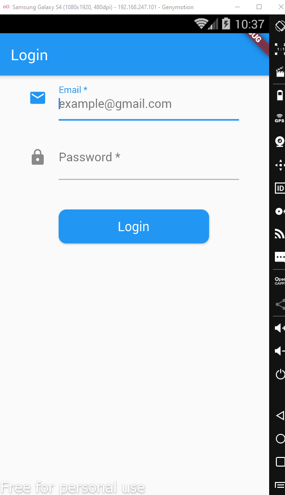
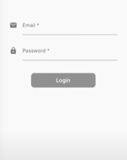
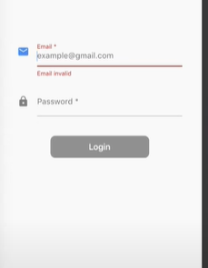
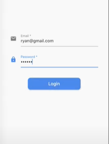

# Project tạo trang Login


## 1. Tạo giao diện trang Login
1.1 Trang Login gồm 2 thuộc tính : Email và Password


1.2 Code tạo trường Email
 ```
 StreamBuilder<String>(
              stream: loginViewModel.emailStream,
              builder: (context, snapshot) {
                return TextFormField(
                  controller: emailController,
                  decoration: InputDecoration(
                    icon: Icon(Icons.email),
                    hintText: "example@gmail.com",
                    labelText: "Email *",
                    errorText: snapshot.data,
                  ),
                );
              }),
 ```
1.3 Code tạo trường Passwword
```
StreamBuilder<String>(
              stream: loginViewModel.passStream,
              builder: (context, snapshot) {
                return TextFormField(
                  controller: passController,
                  obscureText: true,
                  decoration: InputDecoration(
                    icon: Icon(Icons.lock),
                    labelText: "Password *",
                    errorText: snapshot.data,
                  ),
                );
              }),
```
1.4 Code tạo btton Login
```
SizedBox(
            width: 200,
            height: 45,
            child: StreamBuilder<bool>(
                stream: loginViewModel.btnStream,
                builder: (context, snapshot) {
                  return RaisedButton(
                    color: Colors.blue,
                    shape: RoundedRectangleBorder(
                        borderRadius: BorderRadius.circular(10)),
                    onPressed: snapshot.data == true ? () {} : null,
                    child: Text(
                      "Login",
                      style: TextStyle(
                        color: Colors.white,
                        fontSize: 17,
                      ),
                    ),
                  );
                }),
          )
```

## 2. Khi người dùng chưa nhập Email và Password thì sẽ ko thể click button Login
  

  Code thể hiện chức năng :
```
   onPressed: snapshot.data == true ? () {} : null,
```
## 3. Validate trường email và password khi người dùng nhập sai format hoặc không nhập


Code thể hiện chức năng:
```
class Validation {
  static String validatePass(String pass) {
    if (pass == null) {
      return "Password invalid";
    }
    if (pass.length < 6) {
      return "Password require minimum 6 characters";
    }
    return null;
  }

  static String validateEmail(String email) {
    if (email == null) {
      return "Email invalid";
    }
    var isValid =
        RegExp(r"^[a-zA-Z0-9.]+@[a-zA-Z0-9]+\.[a-zA-Z]+").hasMatch(email);
    if (!isValid) {
      return "Email invalid";
    }
    return null;
  }
}
```

## 4. Khi validate thành công để đăng nhập



